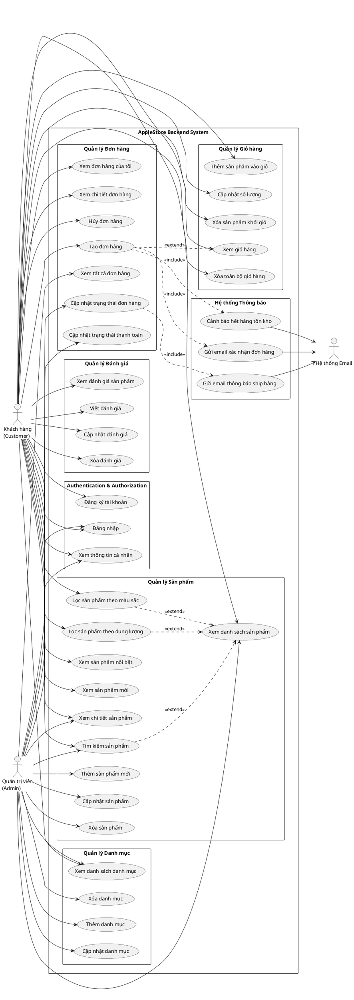

# 📊 Use Case Diagram - AppleStore Backend

## Sơ đồ Use Case



## Mô tả chi tiết các Use Case

### 🔐 **Authentication & Authorization**

| Use Case ID | Tên Use Case | Actor | Mô tả |
|-------------|--------------|-------|-------|
| UC1 | Đăng ký tài khoản | Customer | Khách hàng tạo tài khoản mới với email, password, thông tin cá nhân |
| UC2 | Đăng nhập | Customer, Admin | Đăng nhập vào hệ thống bằng email/password, nhận JWT token |
| UC3 | Xem thông tin cá nhân | Customer, Admin | Xem thông tin profile của user hiện tại |

### 📱 **Quản lý Sản phẩm**

| Use Case ID | Tên Use Case | Actor | Mô tả |
|-------------|--------------|-------|-------|
| UC4 | Xem danh sách sản phẩm | Customer, Admin | Xem tất cả sản phẩm iPhone có sẵn (có phân trang) |
| UC5 | Xem chi tiết sản phẩm | Customer, Admin | Xem thông tin chi tiết của một sản phẩm |
| UC6 | Tìm kiếm sản phẩm | Customer, Admin | Tìm kiếm sản phẩm theo tên, mô tả |
| UC7 | Lọc sản phẩm theo màu sắc | Customer | Lọc sản phẩm theo màu (Blue, Black, White...) |
| UC8 | Lọc sản phẩm theo dung lượng | Customer | Lọc sản phẩm theo storage (128GB, 256GB, 512GB...) |
| UC9 | Xem sản phẩm nổi bật | Customer | Xem các sản phẩm được đánh dấu featured |
| UC10 | Xem sản phẩm mới | Customer | Xem các sản phẩm mới ra mắt (new arrivals) |
| UC11 | Thêm sản phẩm mới | Admin | Thêm sản phẩm iPhone mới vào hệ thống |
| UC12 | Cập nhật sản phẩm | Admin | Cập nhật thông tin sản phẩm (giá, tồn kho...) |
| UC13 | Xóa sản phẩm | Admin | Xóa sản phẩm khỏi hệ thống |

### 🛒 **Quản lý Giỏ hàng**

| Use Case ID | Tên Use Case | Actor | Mô tả |
|-------------|--------------|-------|-------|
| UC14 | Xem giỏ hàng | Customer | Xem tất cả sản phẩm trong giỏ hàng |
| UC15 | Thêm sản phẩm vào giỏ | Customer | Thêm sản phẩm vào giỏ với số lượng |
| UC16 | Cập nhật số lượng | Customer | Thay đổi số lượng sản phẩm trong giỏ |
| UC17 | Xóa sản phẩm khỏi giỏ | Customer | Xóa một sản phẩm khỏi giỏ hàng |
| UC18 | Xóa toàn bộ giỏ hàng | Customer | Xóa tất cả sản phẩm trong giỏ |

### 📦 **Quản lý Đơn hàng**

| Use Case ID | Tên Use Case | Actor | Mô tả |
|-------------|--------------|-------|-------|
| UC19 | Tạo đơn hàng | Customer | Tạo đơn hàng từ giỏ hàng, nhập địa chỉ giao hàng |
| UC20 | Xem đơn hàng của tôi | Customer | Xem tất cả đơn hàng của customer hiện tại |
| UC21 | Xem chi tiết đơn hàng | Customer | Xem chi tiết một đơn hàng cụ thể |
| UC22 | Hủy đơn hàng | Customer | Hủy đơn hàng (chỉ khi ở trạng thái Pending/Confirmed) |
| UC23 | Xem tất cả đơn hàng | Admin | Admin xem tất cả đơn hàng trong hệ thống |
| UC24 | Cập nhật trạng thái đơn hàng | Admin | Cập nhật trạng thái: Pending → Confirmed → Shipped → Delivered |
| UC25 | Cập nhật trạng thái thanh toán | Admin | Cập nhật trạng thái thanh toán: Pending → Paid → Failed |

### ⭐ **Quản lý Đánh giá**

| Use Case ID | Tên Use Case | Actor | Mô tả |
|-------------|--------------|-------|-------|
| UC26 | Xem đánh giá sản phẩm | Customer | Xem tất cả review của một sản phẩm |
| UC27 | Viết đánh giá | Customer | Viết review cho sản phẩm đã mua (rating + comment) |
| UC28 | Cập nhật đánh giá | Customer | Chỉnh sửa review của mình |
| UC29 | Xóa đánh giá | Customer | Xóa review của mình |

### 🏷️ **Quản lý Danh mục**

| Use Case ID | Tên Use Case | Actor | Mô tả |
|-------------|--------------|-------|-------|
| UC30 | Xem danh sách danh mục | Customer, Admin | Xem tất cả danh mục sản phẩm |
| UC31 | Thêm danh mục | Admin | Thêm danh mục mới (VD: iPhone 15, iPhone 14...) |
| UC32 | Cập nhật danh mục | Admin | Cập nhật thông tin danh mục |
| UC33 | Xóa danh mục | Admin | Xóa danh mục khỏi hệ thống |

### 🔔 **Hệ thống Thông báo (Observer Pattern)**

| Use Case ID | Tên Use Case | Actor | Mô tả |
|-------------|--------------|-------|-------|
| UC34 | Gửi email xác nhận đơn hàng | Email System | Tự động gửi email khi đơn hàng được tạo |
| UC35 | Gửi email thông báo ship hàng | Email System | Tự động gửi email khi đơn hàng được ship |
| UC36 | Cảnh báo hết hàng tồn kho | Email System | Tự động cảnh báo admin khi sản phẩm hết hàng |

## 📈 Phân tích quan hệ

### Include Relationships (<<include>>)
- **UC19 (Tạo đơn hàng)** include **UC34 (Gửi email xác nhận)**: Khi tạo đơn hàng, hệ thống tự động gửi email xác nhận
- **UC24 (Cập nhật trạng thái)** include **UC35 (Gửi email ship hàng)**: Khi đơn hàng chuyển sang trạng thái "Shipped", tự động gửi email
- **UC19 (Tạo đơn hàng)** include **UC36 (Cảnh báo hết hàng)**: Nếu tồn kho <= 0 sau khi đặt hàng, gửi cảnh báo

### Extend Relationships (<<extend>>)
- **UC19 (Tạo đơn hàng)** extend **UC14 (Xem giỏ hàng)**: Đặt hàng mở rộng từ xem giỏ hàng
- **UC6, UC7, UC8 (Tìm kiếm/Lọc)** extend **UC4 (Xem danh sách)**: Các chức năng lọc mở rộng từ xem danh sách

### Generalization
- **Customer** và **Admin** đều có thể đăng nhập (UC2)
- Cả hai đều có thể xem sản phẩm và danh mục

## 🎯 Actors

### 1. Khách hàng (Customer)
**Vai trò**: Người dùng cuối, mua hàng trên hệ thống

**Quyền hạn**:
- ✅ Xem sản phẩm, tìm kiếm, lọc
- ✅ Quản lý giỏ hàng
- ✅ Đặt hàng và theo dõi đơn hàng
- ✅ Viết và quản lý đánh giá
- ❌ Không thể thêm/sửa/xóa sản phẩm

### 2. Quản trị viên (Admin)
**Vai trò**: Quản lý toàn bộ hệ thống

**Quyền hạn**:
- ✅ Tất cả quyền của Customer
- ✅ Thêm/Sửa/Xóa sản phẩm
- ✅ Quản lý danh mục
- ✅ Xem tất cả đơn hàng
- ✅ Cập nhật trạng thái đơn hàng

### 3. Hệ thống Email
**Vai trò**: Actor hệ thống, tự động gửi thông báo

**Chức năng**:
- 📧 Gửi email xác nhận đơn hàng
- 📧 Gửi email thông báo ship hàng
- 📧 Gửi cảnh báo hết hàng

## 🔄 Business Flow

### Flow 1: Quy trình mua hàng (Customer)
```
1. Đăng nhập (UC2)
   ↓
2. Xem sản phẩm (UC4) / Tìm kiếm (UC6)
   ↓
3. Xem chi tiết sản phẩm (UC5)
   ↓
4. Thêm vào giỏ hàng (UC15)
   ↓
5. Xem giỏ hàng (UC14)
   ↓
6. Tạo đơn hàng (UC19)
   ↓
7. Nhận email xác nhận (UC34)
   ↓
8. Theo dõi đơn hàng (UC20, UC21)
   ↓
9. Nhận email ship hàng (UC35)
   ↓
10. Viết đánh giá (UC27)
```

### Flow 2: Quy trình quản lý đơn hàng (Admin)
```
1. Đăng nhập (UC2)
   ↓
2. Xem tất cả đơn hàng (UC23)
   ↓
3. Xem chi tiết đơn hàng (UC21)
   ↓
4. Cập nhật trạng thái: Pending → Confirmed (UC24)
   ↓
5. Cập nhật trạng thái: Confirmed → Shipped (UC24)
   ↓
6. Gửi email thông báo (UC35)
   ↓
7. Cập nhật trạng thái: Shipped → Delivered (UC24)
```

## 📊 Thống kê Use Cases

- **Tổng số Use Cases**: 36
- **Use Cases cho Customer**: 26
- **Use Cases cho Admin**: 16
- **Use Cases tự động (System)**: 3
- **Authentication**: 3 use cases
- **Product Management**: 10 use cases
- **Cart Management**: 5 use cases
- **Order Management**: 7 use cases
- **Review Management**: 4 use cases
- **Category Management**: 4 use cases
- **Notification System**: 3 use cases

---

## 🎨 Cách xem sơ đồ PlantUML

### Option 1: VS Code Extension
1. Cài extension: **PlantUML** (jebbs.plantuml)
2. Mở file này
3. Nhấn `Alt + D` để xem preview

### Option 2: Online
1. Copy code PlantUML
2. Truy cập: https://www.plantuml.com/plantuml/uml/
3. Paste và xem kết quả

### Option 3: IntelliJ IDEA
1. Cài plugin: **PlantUML Integration**
2. Mở file và xem preview

---

**🎯 Use Case Diagram này thể hiện đầy đủ các chức năng của AppleStore Backend API với 2 actors chính (Customer & Admin) và 36 use cases!**
